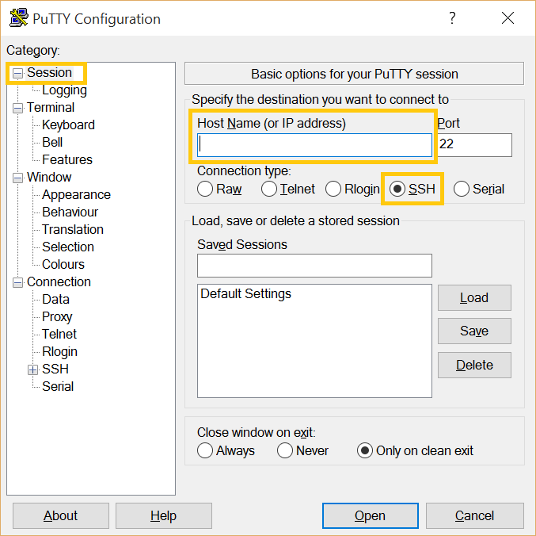
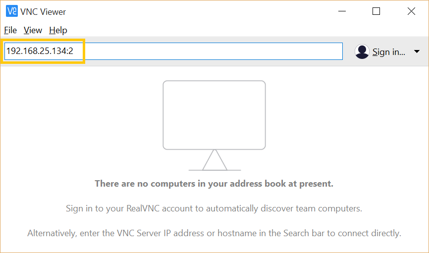
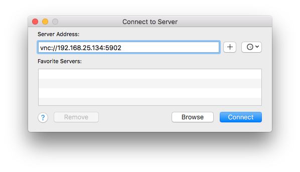
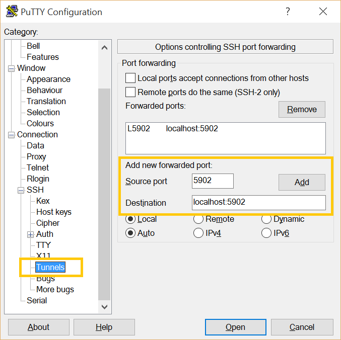
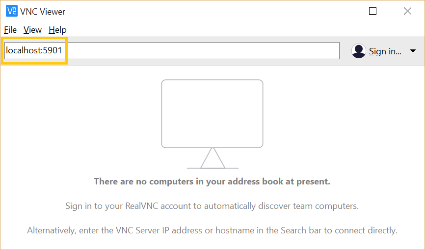
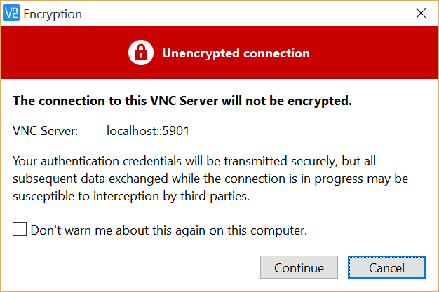
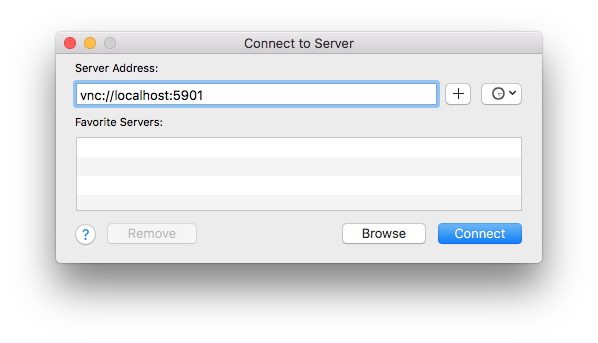

.. _vnc:

Secure Remote Desktop to a Clear Linux Host by VNC’ing Through an SSH Tunnel
############################################################################

Virtual Network Computing (VNC) is a client-server tool that provides remote 
access of |CLOSIA| through a graphical user interface.  In addition to keyboard 
and mouse events, it transmits the remote host’s display over the network to 
the client system.  

This tutorial shows how to:

* Install the VNC server on a |CL| host
* Configure the server for 2 different VNC-server-start methods
* Install a VNC viewer app on the client system
* Initiate a VNC session and connect it to from a client
* Establish a secure SSH tunnel to encrypt VNC traffic 

Enable the VNC server components on the |CL| host
-------------------------------------------------
#.	Log in and get root privileges.

	.. code-block:: console

		$ sudo -s

#.	Install these bundles and reboot the system to start the necessary services.

	.. code-block:: console

		# swupd bundle-add os-utils-gui openssh-server
		# reboot

	.. note::

		* `os-utils-gui`: to get the TigerVNC server and the XFCE X Display Manager
		* `openssh-server`: to provide SSH functionality
		* The default X Display Manager presented through VNC on |CL| is XFCE.  
		  To use the Gnome Display Manager (GDM) instead, add the `desktop-autostart` 
		  bundle.

Configure the VNC server start methods on the |CL| host
-------------------------------------------------------
There are several methods to start the VNC server on the host before the client 
can connect to it.  The first method requires the user to SSH in and manually 
start it.  The second is to automate the starting of the VNC server by setting up 
a Systemd service script for each user.  Both methods can be deployed 
concurrently on the same host.  

Configuring for these methods are detailed below.   

Method 1: User manually starts the VNC server
*********************************************
Each user must perform these steps to initialize the VNC settings for their use.

#.	Login as the user. 

#.	Create the initial VNC settings.  A password must be set.    

	.. code-block:: console

		$ vncserver 

	Example output:

		.. code-block:: console

			$ vncserver

			You will require a password to access your desktops.

			Password:
			Verify:
			Would you like to enter a view-only password (y/n)? n
			xauth:  file /home/vnc-user-a/.Xauthority does not exist

			New 'clr-linux:2 (vnc-user-a)' desktop is clr-linux:2

			Creating default startup script /home/vnc-user-a/.vnc/xstartup
			Creating default config /home/user-a/.vnc/config
			Starting applications specified in /home/vnc-user-a/.vnc/xstartup
			Log file is /home/vnc-user-a/.vnc/clr-linux:2.log

	Upon completion, VNC will add default configuration files and a password file 
	in a hidden directory (`%HOME/.vnc`) for that user.  

	Also, a VNC session will start.  VNC will show the display ID (the number 
	following the colon ‘`:`’) for this session.  In the above example, the display 
	ID is 2.  The display ID is needed for the client app to specify which session 
	to connect to.  

#.	Kill the VNC session for the time being with this command (substitute 
	`<display-id>` with appropriate value):

	.. code-block:: console

		$ vncserver -kill :<display-id>

	.. note::

		To list active VNC sessions, enter this command:

		.. code-block:: console

			$ vncserver -list

#.	Optional configurations.

	* To customize settings such as screen size, security type, etc., modify 
	  the `%HOME/.vnc/config` file.  
	* To customize the applications to run at startup, modify 
	  the `%HOME/.vnc/xstartup` file.  

	See the `vncserver` Man page for additional information.

Method 2: Automate starting the VNC server on-demand for each user
******************************************************************
To automatically start a VNC session for each user via a Systemd service, the 
system administrator must perform these steps.    

#.	Log in and get root privileges.

	.. code-block:: console

		$ sudo -s

#.	Make sure the user accounts already exit.  Use the following to list all users:

	.. code-block:: console

		# cut -d: -f1 /etc/passwd

#.	Create a service script called `vncserver@:X.service` (where is `X` the display 
	ID) for each user in `/etc/systemd/system`.  Each user is assigned a unique display 
	ID number.  Below is an example showing `vnc-user-b` is assigned a display ID of 
	‘`5`’ via the service filename.  

	.. code-block:: console

		# mkdir -p /etc/system/system
		# cat > /etc/systemd/system/vncserver@:5.service << EOF

		[Unit]
		Description=VNC Remote Desktop Service for VNC-user-b
		After=syslog.target network.target

		[Service]
		Type=simple
		User=vnc-user-b
		PAMName=login
		PIDFile=/home/vnc-user-b/.vnc/%H%i.pid
		ExecStartPre=/bin/sh -c '/usr/bin/vncserver -kill %i > /dev/null 2>&1 || :'
		ExecStart=/usr/bin/vncserver %i -geometry 2000x1200 -alwaysshared -fg
		ExecStop=/usr/bin/vncserver -kill %i

		[Install]
		WantedBy=multi-user.target

		EOF

	.. note::

		* Be sure the correct username is entered for the `User` and `PIDFile` 
		  fields.  The username in `Description` field is optional, but useful for 
		  `systemctl` service identification purpose.
		* To see additional parameters that can be supplied to `vncserver`, see 
		  the `vncserver` Man page.

#.	Each user `MUST` log into his/her account and set a VNC password with the 
	`vncpasswd` command `BEFORE` proceeding to the next step.

#.	Start the VNC service scripts and also set it to start automatically after 
	the |CL| host boots. Now, a VNC session for each user will start automatically 
	when a VNC client connection is initiated.    

	.. code-block:: console

		# systemctl daemon-reload
		# systemctl start vncserver@:X.service
		# systemctl enable vncserver@:X.service

#.	After starting the services, verify they are running.  

	.. code-block:: console

		# systemctl | grep vnc

	Below is an example of 2 services that were started successfully for users 
	`vnc-user-b` and `vnc-user-c`.

	.. code-block:: console

		# systemctl | grep vnc

		vncserver@:5.Service 	loaded active running   VNC Remote Desktop Service for VNC-user-b                           
		vncserver@:6.service 	loaded active running   VNC Remote Desktop Service for VNC-user-c                           
		system-vncserver.slice 	loaded active active    system-vncserver.slice    

Install VNC viewer and SSH client on the client system
******************************************************
On the client system side, a VNC viewer app is needed.  An SSH client is only
needed if the VNC-server-side start method is manual (Method 1 as described above).   

#.	Install a VNC viewer app on the client system.
	
	* On some example Linux distros:		
		- Clear Linux:	 

			.. code-block:: console

				# swupd bundle-add desktop-autostart
		
		- Ubuntu, Mint:

			.. code-block:: console

				# apt-get install xtightvncviewer 

		- Fedora: 

			.. code-block:: console

				# dnf install tigervnc

	* On Windows:

		- Install `RealVNC`_ for Windows 

	* On macOS:

		- Use the built-in `Screen Sharing` app

#.	Install an SSH client app on the client system.

	* On most Linux distros (Clear Linux, Ubuntu, Mint, Fedora, etc.) and macOS:

		- SSH is already built-in

	* On Windows:

		- Install `Putty`_

Initiate a VNC session on the |CL| host
***************************************
If the VNC server is configured for manual start (Method 1 described above),
the user must manually SSH in and start a VNC session by following these steps
first.  Otherwise, skip to the `Connect to VNC session on |CL| host section below.

#.	SSH into the |CL| host.

		* On Linux distros and macOS:

			.. code-block:: console
		
				$ ssh <username>@<clear-linux-host-ip-address>

		* On Windows:
			
			-	Launch `Putty`
			-	Under the `Category` section, go to `Session`
			-	Enter the IP address of the |CL| host in the `Host Name (or IP 
			  	address)` field. (See Figure 1)
			-	Set the `Connection type` to `SSH`

				|vnc-01|
			
				Figure 1: Putty - configure SSH session information

			- Click Open.

#.	Log in.

#.	Start a VNC session and take note of the assigned display ID (3 in this 
	example).  It will be used to establish a connection from the client side.

	.. code-block:: console

		$ vncserver

	Example Output:

		.. code-block:: console

			$ vncserver

			New 'clr-linux:3 (vnc-user-c)' desktop is clr-linux:3

			Starting applications specified in /home/vnc-user-c/.vnc/xstartup
			Log file is /home/vnc-user-c/.vnc/clr-linux:3.log

	.. note::
		
		VNC automatically picks a unique display ID unless one is specified.  
		To specify one, simply enter a unique number that is not already in
		use after the colon.  For example: 		

		.. code-block:: console

			$ vncserver :8

#.	End the SSH session by logging out, if desired.  This will not terminate 
	the active VNC session.   

Connect to VNC session on the |CL| host
***************************************
The VNC server listens on port 5900.  When connecting to a specific active 
VNC session, there 2 ways to specify it: Use either 5900 + the display ID 
number or just the display ID.  For example: if the display ID is 3, it can be 
specified as 5903 or simply 3.  For simplicity, the instructions below will 
only use the display ID format.  

* On Linux distros:
	#.	Open terminal emulator and enter:

		.. code-block:: console

			$ vncviewer <clear-linux-host-ip-address>:<display-id>

	#.	Enter the appropriate VNC password.

* On Windows:
	#.	Start the RealVNC viewer app.

	#.	Enter the IP address of the |CL| host and the VNC display ID.  
		Here’s a screenshot example which shows connecting to a VNC session whose
		|CL| host IP address is 192.168.25.134 and display ID is 2.

		|vnc-02|

		Figure 2: RealVNC client

	#.	Enter the appropriate VNC password.

* On macOS:
	#.	Go to `Finder` > `Go` > `Connect to Server`.
	#.	Enter `vnc://<clear-linux-host-ip-address>:<display-ID>` in the 
		`Server Address` field.  (See Figure 3)

		|vnc-03|
		
		Figure 3: macOS VNC client
	
	#.	Click `Connect`.
	#.	Enter the appropriate VNC password.

End a VNC connection
********************
For users who used Method 1 to start a VNC session, the VNC session will remain 
active even if the VNC client connection has terminated.  To stop the active VNC 
session, follow these steps:

#.	SSH into the Clear Linux host.

#.	Find the active VNC display ID.

	.. code-block:: console
		
		$ vncserver -list

#.	Terminate it.

	.. code-block:: console
		
		$ vncserver -kill :<display-ID>

Encrypt VNC traffic through an SSH tunnel
*****************************************
By default, VNC traffic is in the clear and is not encrypted.  To add security, 
VNC traffic can be routed through an SSH tunnel.  This is accomplished by 3 steps:

#.	Configure the VNC server to only allow VNC traffic through SSH connection 
	by using the `localhost` option.  For more information, see http://tigervnc.org/doc/Xvnc.html. 

#.	Set up an SSH tunnel from the client side to the VNC host.  The client 
	will forward traffic from the localhost (the client) destined for a specified 
	VNC port (on the client) to the VNC host of the same port.  

#.	The VNC viewer app on the client side will now connect to localhost (instead 
	of the IP address of the VNC host) + the display ID.  

Follow these steps:

#.	VNC server host side configuration

	* For Method 1 (Manual start)
		-	Each user must edit %HOME/.vnc/config and uncomment the localhost line.  
			It should look like this:

			.. code-block:: console

				## Supported server options to pass to vncserver upon invocation can be listed
				## in this file. See the following manpages for more: vncserver(1) Xvnc(1).
				## Several common ones are shown below. Uncomment and modify to your liking.
				##
				# securitytypes=vncauth,tlsvnc
				# desktop=sandbox
				# geometry=2000x1200
				localhost
				# alwaysshared

		-	If an active session exists, kill it and restart it. 

	*	For Method 2 (Automatic start)

		-	Edit the Systemd service scripts in `/etc/systemd/system` and add 
			`-localhost` to the `ExecStart` field.  Here’s an example of 
			`vncserver@:5.service`:

			.. code-block:: console

				[Unit]
				Description=VNC Remote Desktop Service for VNC-user-b
				After=syslog.target network.target

				[Service]
				Type=simple
				User=vnc-user-b
				PAMName=login
				PIDFile=/home/vnc-user-b/.vnc/%H%i.pid
				ExecStartPre=/bin/sh -c '/usr/bin/vncserver -kill %i > /dev/null 2>&1 || :'
				ExecStart=/usr/bin/vncserver %i -geometry 2000x1200 -localhost -alwaysshared -fg
				ExecStop=/usr/bin/vncserver -kill %i

				[Install]
				WantedBy=multi-user.target

		-	Restart the service script

			.. code-block:: console

				# systemctl daemon-load
				# systemctl restart vncserver@:5.service

	*	Use the netstat command to verify it’s working by executing:

		.. code-block:: console

			$ netstat -plant

		.. note::
				
			Add the `network-basic` bundle to get the `netstat` command.

		Figure 4 shows VNC server accepting connection from any host as 
		designated by the `0.0.0.0`.  This is before the localhost option was used.  

		|vnc-04| 
		
		Figure 4: VNC server accepting connection from any host

		After the localhost configuration, Figure 5 shows that VNC will only 
		accept connection from `127.0.0.1`.  

		|vnc-05|

		Figure 5: VNC server will only accept connection from `localhost`

#.	Establish an SSH tunnel on the client side 
	
	*	On Linux distros and macOS:

		-	Open terminal emulator and enter:

			.. code-block:: console

				$ ssh -L <VNC-port-plus-display-id>:localhost:<VNC-port-plus-display-id> 
				-N -f -l <username> <clear-linux-host-ip-address>

		-	Enter password (not VNC password)

		.. note::

			*	Replace `<VNC-port-plus-display-id>` with 5900 (VNC default port) 
				plus the appropriate display ID.  For example, if the display ID 
				is 1, the value is 5901.  
			*	`-L` specifies that the port on the localhost (on the client) is 
				forwarded to port on the server side
			*	`-N` tells it to only forward ports and not execute a remote command
			*	`-f` tells SSH to go into the background before command execution
			*	`-l` specifies the user to log in as 

	*	On Windows:

		-	Launch Putty.

		-	Specify the VNC host to connect to.
				-	Under the `Category` section, go to `Session`
				-	Enter the IP address of the Clear Linux host in the 
					`Host Name (or IP address)` field. 
					(For an example, See Figure 1)

		-	Configure the SSH tunnel.
				-	Under the `Category` section, go to 
					`Connection` > `SSH` > `Tunnels`
				-	In the Source Port field, enter the VNC port plus the 
					display ID (For example: 5901)
				-	In the `Destination` field, enter 
					`localhost:<VNC-port-plus-display-id>`
				-	Click `Add`
				-	Here’s an example using display ID 1.  (See Figure 6)

					|vnc-06|
					
					Figure 6: Putty - configure SSH tunnel

		-	Click `Open`.

		-	Enter username and password (not VNC password)

#.	Connect to the VNC server with a VNC viewer app through the SSH tunnel

	*	On Linux distros:

		-	Open terminal emulator and enter:

			.. code-block:: console

				$ vncviewer localhost:<display-ID>

	*	On Windows:

		-	Start the RealVNC viewer app.

		-	Enter localhost and the VNC display ID.  See Figure 7 for a 
			screenshot example which shows connecting to localhost with VNC 
			display ID of 1.

			|vnc-07| 

			Figure 7: RealVNC viewer app connecting to localhost:5901

			.. note::					

				RealVNC will warn that the connection is not encrypted even 
				through its traffic is going through the SSH tunnel.  
				This can be ignored.  (See Figure 8)

				|vnc-08|

				Figure 8: RealVNC viewer warning

	*	On macOS:

		-	Go to `Finder` > `Go` > `Connect to Server`.
	
		-	Enter `vnc://localhost:<display-ID>` in the `Server Address` field.  
			(See Figure 9)

			|vnc-09| 

			Figure 9: 

		-	Click `Connect`.
	
		-	Enter the appropriate VNC password.

.. _RealVNC: https://www.realvnc.com/en/connect/download/viewer/windows/
.. _Putty: https://the.earth.li/~sgtatham/putty/latest/w64/putty-64bit-0.70-installer.msi

.. |vnc-04| image:: figures/netstat-plant-before-4.png
.. |vnc-05| image:: figures/netstat-plant-after-5.png

